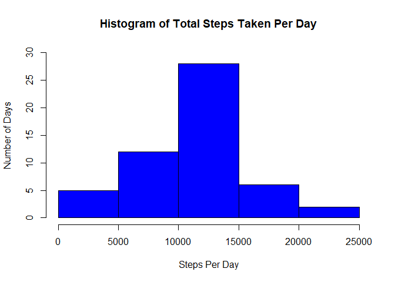
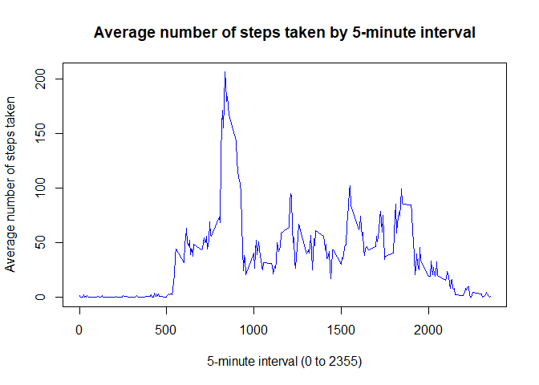
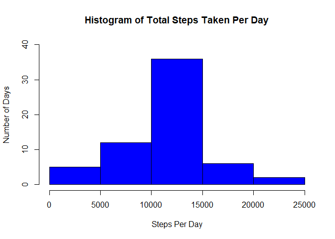
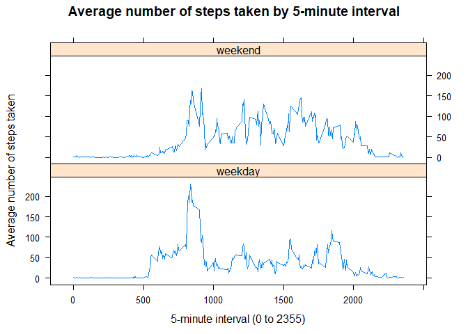

This assignment makes use of data from a personal activity monitoring device. This device collects data at 5 minute intervals through out the day. The data consists of two months of data from an anonymous individual collected during the months of October and November, 2012 and include the number of steps taken in 5 minute intervals each day.

The data for this assignment can be downloaded from the below URL:

- [Activity monitoring data](https://d396qusza40orc.cloudfront.net/repdata%2Fdata%2Factivity.zip)

The variables included in this dataset are:

1. **steps**: Number of steps taking in a 5-minute interval (missing values are coded as NA )
2. **date**: The date on which the measurement was taken in YYYY-MM-DD format
3. **interval**: Identifier for the 5-minute interval in which measurement was taken

Load the necessary libraries without output to avoid unecessary verbose warnings


```r
library(lubridate)
library(lattice)
```

### Loading and preprocessing the data

Download and unzip the source data file if necessary and load the activity data into a data frame


```r
actDataUrl <- "https://d396qusza40orc.cloudfront.net/repdata%2Fdata%2Factivity.zip"
actDataFileZip <- "activity.zip"
actDataFile <- "activity.csv"

# Download the activity zip file and unzip if data file not found
if (!file.exists(actDataFile)) {
  download.file(actDataUrl, actDataFileZip, mode = "wb")
  unzip(actDataFileZip)
}

# Use read.csv to load activity data into data frame
actData <- read.csv(file = actDataFile, header = TRUE, na.strings = "NA")
```

Perform a high level inspection of the data


```r
# High level inspection of the data
str(actData)
```

```
## 'data.frame':	17568 obs. of  3 variables:
##  $ steps   : int  NA NA NA NA NA NA NA NA NA NA ...
##  $ date    : chr  "2012-10-01" "2012-10-01" "2012-10-01" "2012-10-01" ...
##  $ interval: int  0 5 10 15 20 25 30 35 40 45 ...
```

```r
head(actData)
```

```
##   steps       date interval
## 1    NA 2012-10-01        0
## 2    NA 2012-10-01        5
## 3    NA 2012-10-01       10
## 4    NA 2012-10-01       15
## 5    NA 2012-10-01       20
## 6    NA 2012-10-01       25
```

### What is mean total number of steps taken per day?

Determine the total steps taken per day and plot the histogram with missing values are ignored.


```r
# Calculate the total steps taken per day (NA are ignored by default)
totalStepsByDt <- aggregate(steps ~ date, data = actData, sum)

# Generate the histogram of the total number of steps taken per day
hist(totalStepsByDt$steps
     , col = 'blue'
     , main = 'Histogram of Total Steps Taken Per Day'
     , xlab = 'Steps Per Day'
     , ylab = 'Number of Days'
     , ylim = c(0, 30)
     )
```



Calculate the mean and medium of the total number of steps taken per day.


```r
# Caculate mean total number of steps taken per day
meanTotalStepsByDt <- mean(totalStepsByDt$steps)
meanTotalStepsByDt
```

```
## [1] 10766.19
```

```r
# Caculate medium total number of steps taken per day
medianTotalStepsByDt <- median(totalStepsByDt$steps)
medianTotalStepsByDt
```

```
## [1] 10765
```

Mean total number of steps taken per day is 10766.19 steps.

Median total number of steps taken per day is 10765 steps.


### What is the average daily activity pattern?


Determine the total steps taken per interval. Missing values are ignored for this part of the assignment.


```r
# Calculate the total steps taken per interval (NA are ignored by default)
meanStepsByInt <- aggregate(steps ~ interval, data = actData, mean)
```
Generate time series plot of the 5-minute interval (x-axis) and the average number of steps taken, averaged across all days (y-axis).


```r
plot(steps ~ interval, data = meanStepsByInt, type = "l", col = "blue",
     xlab = "5-minute interval (0 to 2355)",
     ylab = "Average number of steps taken",
     main = "Average number of steps taken by 5-minute interval")
```



Determine which 5-minute interval, on average across all the days in the dataset, contains the maximum number of steps.


```r
maxStepInd = which.max(meanStepsByInt$steps)
maxStepInt = meanStepsByInt[maxStepInd,"interval"]
maxStepInt
```

```
## [1] 835
```

```r
maxSteps = meanStepsByInt[maxStepInd, "steps"]
maxSteps
```

```
## [1] 206.1698
```

On average the 5-minute interval with maximum number of steps of 206.1698 is taken on 835 interval.

### Imputing missing values

Calculate and report the total number of missing values in the dataset (i.e. the total number of rows with NAs)


```r
colSums(is.na(actData))
```

```
##    steps     date interval 
##     2304        0        0
```

Summing the logical result of the NA check shows only `steps` column have missing values. And there are a total of 2304 missing values.

We will replace the NA values found in the steps column with the mean steps for that particular 5-mimute interval based on entire data set


```r
# Create new imputed data frame from original activity data
impActData <- actData

# Loop over all the individual rows
for (row in 1:nrow(impActData)) {

    # Check if the steps value is NA
    if (is.na(impActData[row, 'steps'])) {

        # Obtain the index of the current interval from the aggregated by interval mean dataframe
        intervalIdx = which(meanStepsByInt[, 'interval'] == impActData[row, 'interval'])

        # Rreplace NA value with the mean for this interval
        impActData[row, 'steps'] = meanStepsByInt[intervalIdx, 'steps']
    }
}
```

Regenerate the histogram of the total number of steps taken each day based on imputed data set.


```r
# Calculate the total steps taken per day (NA are ignored by default)
impTotalStepsByDt <- aggregate(steps ~ date, data = impActData, sum)

# Generate the histogram of the total number of steps taken per day
hist(impTotalStepsByDt$steps
     , col = 'blue'
     , main = 'Histogram of Total Steps Taken Per Day'
     , xlab = 'Steps Per Day'
     , ylab = 'Number of Days'
     , ylim = c(0, 40)
     )
```



Recalculate the mean and medium of the total number of steps taken per day based on imputed data set


```r
# Caculate mean total number of steps taken per day
impMeanTotalStepsByDt <- mean(impTotalStepsByDt$steps)
impMeanTotalStepsByDt
```

```
## [1] 10766.19
```

```r
# Caculate medium total number of steps taken per day
impMedianTotalStepsByDt <- median(impTotalStepsByDt$steps)
impMedianTotalStepsByDt
```

```
## [1] 10766.19
```

Mean total number of steps taken per day for imputed data is 10766.19 steps.

Median total number of steps taken per day for imputed data is 10766.19 steps.

The mean total number of steps taken per day is identical to the mean obtained from the original data set. While the median is 10,766.19 steps which is slightly up from 10,765 steps in the original data set.

Using the mean number of steps interval strategy for replacing missing data has little impact on the mean and median total number of steps taken per day.

### Are there differences in activity patterns between weekdays and weekends?

Create a new factor variable in the dataset with two levels "weekday" and "weekend" indicating whether a given date is a weekday or weekend day.


```r
# Check date from imputed data is a weekday and create weekday field indicator
# Made use of lubridate wday function to address locale-dependent issue
weekdayInd <- ifelse(wday(impActData$date) %in%  2:6, "weekday", "weekend")

# Add new weekday indicator factor field into imputed data.
impActData$weekdayInd <- factor(weekdayInd)

# Check updated results
str(impActData)
```

```
## 'data.frame':	17568 obs. of  4 variables:
##  $ steps     : num  1.717 0.3396 0.1321 0.1509 0.0755 ...
##  $ date      : chr  "2012-10-01" "2012-10-01" "2012-10-01" "2012-10-01" ...
##  $ interval  : int  0 5 10 15 20 25 30 35 40 45 ...
##  $ weekdayInd: Factor w/ 2 levels "weekday","weekend": 1 1 1 1 1 1 1 1 1 1 ...
```

Make a panel plot containing a time series plot of the 5-minute interval (x-axis) and the average number of steps taken, averaged across all weekday days or weekend days (y-axis)


```r
# Summarise the data by interval and type of the day calculating the mean steps
meanStepsByIntDayType <- aggregate(steps ~ interval + weekdayInd, data = impActData, mean)

# Generate the pair of time series plots for average steps for weekday and weekends
xyplot(steps ~ interval | weekdayInd, data = meanStepsByIntDayType, type = "l",
     xlab = "5-minute interval (0 to 2355)",
     ylab = "Average number of steps taken",
     main = "Average number of steps taken by 5-minute interval",
     layout = c(1,2))
```



There are differences between the weekend and weekday plots.

For weekday activity started earlier and with more intensity as compared to weekend likely reflecting the morning transit from home to work followed by much lower till end of day probably due to office work.  

For weekend activity is overall is higher than weekday


